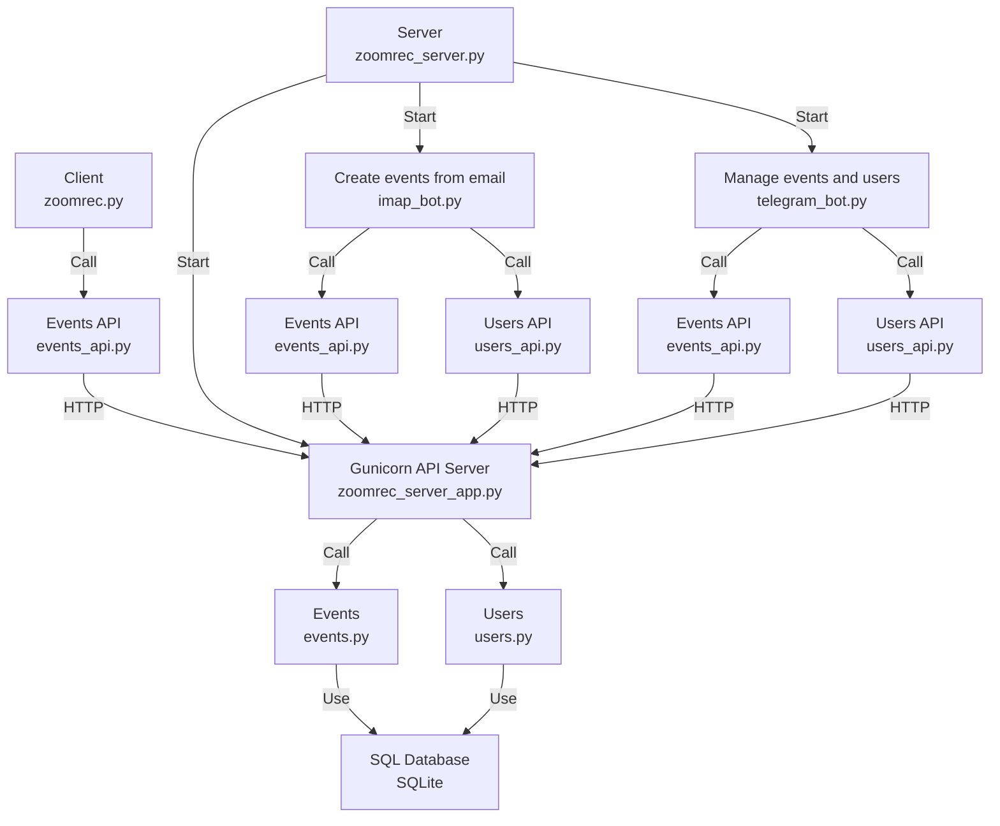

# Zoomrec V2

## Architecture Diagram

```mermaid
graph TD
    C[Client<br>zoomrec.py] 
    C -->|Call| EAc[Events API<br>events_api.py]
    EAc -->|HTTP| A
    S[Server<br>zoomrec_server.py] 
    S -->|Start| A[Gunicorn API Server<br>zoomrec_server_app.py]
    A -->|Call| E[Events<br>events.py]
    A -->|Call| U[Users<br>users.py]
    E -->|Use| DB[SQL Database<br>SQLite]
    U -->|Use| DB[SQL Database<br>SQLite]
    S -->|Start| I[Create events from email<br>imap_bot.py]
    S -->|Start| T[Manage events and users<br>telegram_bot.py]
    I -->|Call| EAi[Events API<br>events_api.py]
    I -->|Call| UAi[Users API<br>users_api.py]
    EAi -->|HTTP| A
    UAi -->|HTTP| A
    T -->|Call| EAt[Events API<br>events_api.py]
    T -->|Call| UAt[Users API<br>users_api.py]
    EAt -->|HTTP| A
    UAt -->|HTTP| A
```
