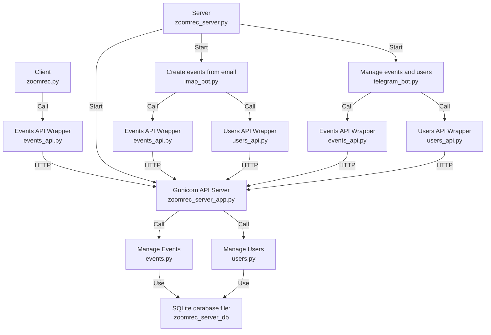

# Zoomrec V2

Zoomrec V2 is a partial re-write/enhancement over [kastldratza/zoomrec](https://github.com/kastldratza/zoomrec) which uses a client/server architecture and hence a client and a server docker container:

* Server: manages events (currently Zoom Meetings) and users (an event is always linked to a user). There are 2 new functionalities supported by the server:
  1. A IMAP bot that monitors an email address and can create events e.g. from the emails sent by zoom using a configuration file[**example/email_types_example.yaml**](**example/email_types_example**)(). Recurring meetings are supported (RRule)
  2. A text based Telegram bot to manage (CRUD - create,retrieve,update and delete) events and users. Make sure to get a TELEGRAM BOT token and add it to the server config
* Client: retrieving events and recording them. Multiple clients can connect to a server. Once a meeting has started, the meeting gets assigned to client that was joining.

Planned version 2 features: (note: features completed have only undergone basic testing)

- [X] zoomrec client (that actually records the meeting) receives its meetings from the zoomrec server via JSON API (no more local meetings.csv)
- [X] zoomrec server has all JSON APIs to create/modify/delete meetings which will allow to build better UIs e.g. a graphical telegram UI or app
- [X] zoomrec client supports a postprocessing script e.g. to transcribe meetings after recording. I use an ESP8266 that connects to the server to find out if a meetings is about to start and starts a PC with zoomrec client. It also switches the PC off if meetings is beyond its scheduled end - but with postprocessing it is not possible to predict when all is finished. Therefore, a status concept for the meetings is introduced, such that the ESP8266 knows when meeting has ended including postprocessing
- [X] zoomrec server using sqlite instead csv files to manage meetings and users
- [X] use Ubuntu 24.04 LTE as base image for client and server dockers
- [X] support multiple zoomrec clients to allow recording in parallel (meetings get assigned to clients)
- [X] zoomrec server supports users and meetings are linked to user. User record contains email details and telegram id to update user about meetings recorded/added. Currently user information like telegram id is stored in the meetings (and therefore duplicated and not possible to centrally manage)
- [X] Support hardware assisted video encoding for using VAAPI or NVIDIA
- [ ] currently the zoomrec clients has a SMB server included to access the recordings remotely but that only works in a LAN. The zoomrec server will have an sftp server and the client transfers the recording to the server, where they can be accessed from the internet (another reason to have a user database to manage the access via sftp)
- [ ] build a YAML based configuration framework for the screen control to accommodate Zoom changes in UI behavior and also support other tools like teams. The screen control doesn't work anymore for latest zoom version out of the box, so new screenshots of buttons and labels are required anyway, so this seems to be the right time to do this on conjunction with allowing to work with latest Zoom versions. At the moment I use the oldest supported version to avoid touching the screen control logic (which is a bit of Spaghetti code - but largely works for now)
- [ ] Support other online meeting apps like Teams

## Quickstart

1. Create local zoomrec home directory:

   ```
   ./install_zoomrec.sh ~/zoomrec_home
   ```
2. Edit the config files in the newly created home directory and replace <...> with the required information. Read here how to aquire the [telegram bot token](https://core.telegram.org/bots/tutorial#obtain-your-bot-tokenhttps:/)
3. Start the script to build and run the docker containers:

   ```
   ./start_zoomrec.sh ~/zoomrec_home/config_server.txt ~/zoomrec_home/config_client.txt
   ```

   or with hardware acceleration (VAAPI or NVIDIA):

   ```
   ./start_zoomrec.sh ~/zoomrec_home/config_server.txt ~/zoomrec_home/config_client.txt VAAPI
   ```

   For VAAPI make sure the correct driver is specified in the client config file:

   ```
    # VAAPI hardware acceleration 
    LIBVA_DRIVER_NAME=d3d12 # intel iGPU Gen 11 (also works under WSL2) supports x265
    # LIBVA_DRIVER_NAME=i965 # older ivy bridge intel iGPU supports x264 
   ```

## Architecture Diagram


