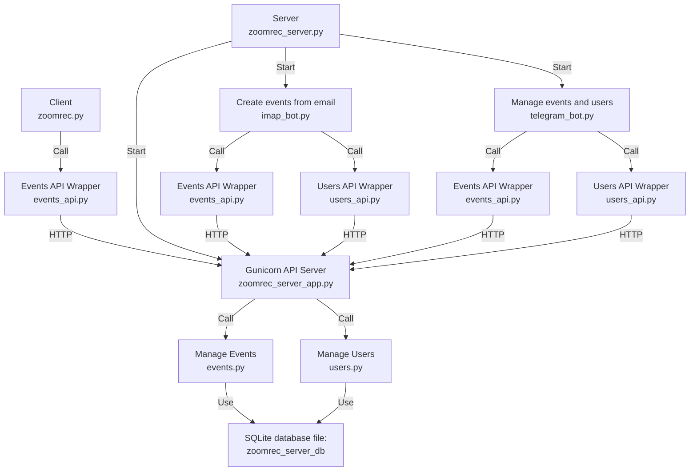

# Zoomrec V2

Zoomrec V2 is a partial re-write/enhancement over [kastldratza/zoomrec](https://github.com/kastldratza/zoomrec) which uses a client/server architecture and hence a client and a server docker container:

* Server: manages events (currently Zoom Meetings) and users (an event is always linked to a user). There are 2 new functionalities supported by the server:
  1. A IMAP bot that monitors an email address and can create events e.g. from the emails sent by zoom using a configuration file [**example/email_types_example.yaml**](**example/email_types_example**). Recurring meetings are supported (RRule)
  2. A text based Telegram bot to manage (CRUD - create,retrieve,update and delete) events and users. Make sure to get a TELEGRAM BOT token and add it to the server config
* Client: retrieving events and recording them. Multiple clients can connect to a server. Once a meeting has started, the meeting gets assigned to client that was joining.

Planned version 2 features: (note: features completed have only undergone basic testing)

- [X] zoomrec client (that actually records the meeting) receives its meetings from the zoomrec server via JSON API (no more local meetings.csv)
- [X] zoomrec server has all JSON APIs to create/modify/delete meetings which will allow to build better UIs e.g. a graphical telegram UI or app
- [X] zoomrec client supports a postprocessing script e.g. to transcribe meetings after recording. I use an ESP8266 that connects to the server to find out if a meetings is about to start and starts a PC with zoomrec client. It also switches the PC off if meetings is beyond its scheduled end - but with postprocessing it is not possible to predict when all is finished. Therefore, a status concept for the meetings is introduced, such that the ESP8266 knows when meeting has ended including postprocessing
- [X] zoomrec server using sqlite instead csv files to manage meetings and users
- [X] use Ubuntu 24.04 LTE as base image for client and server dockers
- [X] support multiple zoomrec clients to allow recording in parallel (meetings get assigned to clients)
- [X] zoomrec server supports users and meetings are linked to user. User record contains email details and telegram id to update user about meetings recorded/added. Currently user information like telegram id is stored in the meetings (and therefore duplicated and not possible to centrally manage)
- [X] Support hardware assisted video encoding for using VAAPI or NVIDIA
- [X] currently the zoomrec clients has a SMB server included to access the recordings remotely but that only works in a LAN. The zoomrec server will have an sftp server and the client transfers the recording to the server, where they can be accessed from the internet (another reason to have a user database to manage the access via sftp)
- [X] build a YAML based configuration framework for the screen control to accommodate Zoom changes in UI behavior and also support other tools like teams. The screen control doesn't work anymore for latest zoom version out of the box, so new screenshots of buttons and labels are required anyway, so this seems to be the right time to do this on conjunction with allowing to work with latest Zoom versions. At the moment I use the oldest supported version to avoid touching the screen control logic (which is a bit of Spaghetti code - but largely works for now)
- [ ] Support other online meeting apps like Teams

## Quickstart

1. Create python environment, activate it and install dependencies:

   ```
   python3 -m venv venv
   source venv/bin/activate
   pip install --upgrade pip
   cd zoomrec
   pip install -r install_requirements.txt
   ```
2. Run install script (in this example installing client and server "BOTH" using VAAPI acceleration)

   ```
   python install_zoomrec.py ~ BOTH VAAPI
   ```

3. Some of the steps (especially using a SFTP server) may require elevated access (sudo). Copy the commands from the install script and paste them into the command shell.

4. Edit .env, .client.env and server.env to provide passwords and other required information like VAAPI drivers, imap bot config, telegram bot config etc.

5. Use docker compose to build and run the containers (use the correct docker-compose files for your setup)
````
docker compose --env-file ~/.env -f docker-compose.yml -f docker-compose.vaapi_intel-wsl2.yaml -f docker-compose.debug.yaml up --build
````
## using TLS/HTTPS with self-signed certificate

1. On server machine generate self-signed key and andcertificated. Using ECDHE-ECDSA-AES128-GCM-SHA256 cipher suite which is considered strong and modern, supporting forward secrecy, efficient authentication, and authenticated encryption and also supported by ESP8266 BearSSL implementation
```
 openssl ecparam -genkey -name prime256v1 -noout -out server.key
```
2. Create a self-signed certificate with SAN extention (subject alternative name). Python SSL/TLS module only relies on subject alternative name (SAN) and not on common name (CN)

openssl req -x509 -sha256 \
  -key server.key \
  -out server.crt \
  -days 36500 \
  -subj "/C=NL/ST=Zuid Holland/L=Rotterdam/O=ACME Corp/OU=IT Dept/CN=example.org"  \
  -addext "subjectAltName = DNS:localhost,DNS:example.org" \
  -addext "basicConstraints=CA:FALSE" \
  -addext "keyUsage=digitalSignature,keyEncipherment" \
  -addext "extendedKeyUsage=serverAuth"

3. Copy the server.key and server.crt 

```
  sudo mkdir -p /etc/ssl/selfsigned 
  sudo cp server.key /etc/ssl/selfsigned/ 
  sudo cp server.crt /etc/ssl/selfsigned/ 
  sudo chown root:root /etc/ssl/selfsigned 
  sudo chmod 700 /etc/ssl/selfsigned 
  sudo chmod 644 /etc/ssl/selfsigned/server.crt 
  sudo chmod 600 /etc/ssl/selfsigned/server.key 
  sudo chown root:root /etc/ssl/selfsigned/server.key 
  sudo chown root:root /etc/ssl/selfsigned/server.crt
```
4. For nginx, add the following SSL settings to the server block:

```
  # Paths to certificate and private key
    ssl_certificate     /etc/ssl/selfsigned/server.crt;
    ssl_certificate_key /etc/ssl/selfsigned/server.key;

    # TLS settings
    ssl_protocols TLSv1.2;
    ssl_ciphers ECDHE-ECDSA-AES128-GCM-SHA256:ECDHE-RSA-AES128-GCM-SHA256;
    ssl_prefer_server_ciphers on;
    ssl_ecdh_curve prime256v1;

    # Session security
    ssl_session_tickets on;
    ssl_session_cache shared:SSL:10m;
    ssl_session_timeout 1h;

```
5. Test config and restart nginx

```
sudo nginx -t
sudo systemctl restart nginx
```

6. On client machine copy the self-signed certificate to the clients config directory

```
cp server.crt ~/config/server.crt
```

7. In .client.env add REQUESTS_CA_BUNDLE environment variable to point to the self-signed certificate

```
# self signed cert for HTTPS
REQUESTS_CA_BUNDLE=$ZOOMREC_HOME/config/server.crt
```

8. Restart client container

9. (Optional if using https://github.com/rkilchmn/ESP8266_zoomrec to turn on client machine based on zoomrec schedule retrieved from server). In config JSON file add the public key for public key pinning:

```
 "tls_server_pubkey": "-----BEGIN PUBLIC KEY-----\\nMFkwEwYHKoZIzj0CAQYIKoZIzj0DAQcDQgAE38HxSo9LBaFlVRhtsdFhfY5+qwfH\\nd5ZA4aTcf+MEQcHF/YiHuH7YIxn39JuV4+b/rOhlwbi2/Bostz/ll5ZGMg==\\n-----END PUBLIC KEY-----"

```


## Possible issues 

### VAAPI on WSL2

Error response from daemon: error gathering device information while adding custom device "/dev/dri": no such file or directory
see https://github.com/microsoft/WSL/issues/11837  
```
sudo modprobe vgem
```

## Architecture

## Principles and Guidelines

* All modules retrieve the required paramters via environment variables which are either passed to the docker container or set via VS launch file when debugging/testing,
* user and event instances are dictonaries with defined keys (class EventField and UserField)
* Interacting with events and users only through the API server. This ensures that there is a central state change control and this is also used to generate state change messages to the owners of the respective object. No direct use of events.py and users.py - always call API server. There are API wrapper modules events_api.py and users_api.py for convenience, where all complexity with http request/response is hidden away.
* All date/time is expressed in the events local timezone.

## Diagram


```mermaid
graph TD
    C[Client<br>zoomrec.py] 
    C -->|Call| EAc[Events API Wrapper<br>events_api.py]
    EAc -->|HTTP| A
    S[Server<br>zoomrec_server.py] 
    S -->|Start| A[Gunicorn API Server<br>zoomrec_server_app.py]
    A -->|Call| E[Manage Events<br>events.py]
    A -->|Call| U[Manage Users<br>users.py]
    E -->|Use| DB[SQLite Database<br>file:zoomrec_server_db]
    U -->|Use| DB[SQLite database file:<br>zoomrec_server_db]
    S -->|Start| I[Create events from email<br>imap_bot.py]
    S -->|Start| T[Manage events and users<br>telegram_bot.py]
    I -->|Call| EAi[Events API Wrapper<br>events_api.py]
    I -->|Call| UAi[Users API Wrapper<br>users_api.py]
    EAi -->|HTTP| A
    UAi -->|HTTP| A
    T -->|Call| EAt[Events API Wrapper<br>events_api.py]
    T -->|Call| UAt[Users API Wrapper<br>users_api.py]
    EAt -->|HTTP| A
    UAt -->|HTTP| A
```
